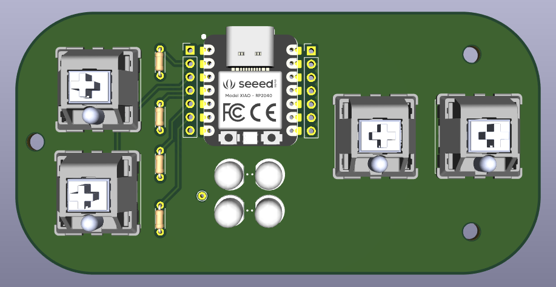
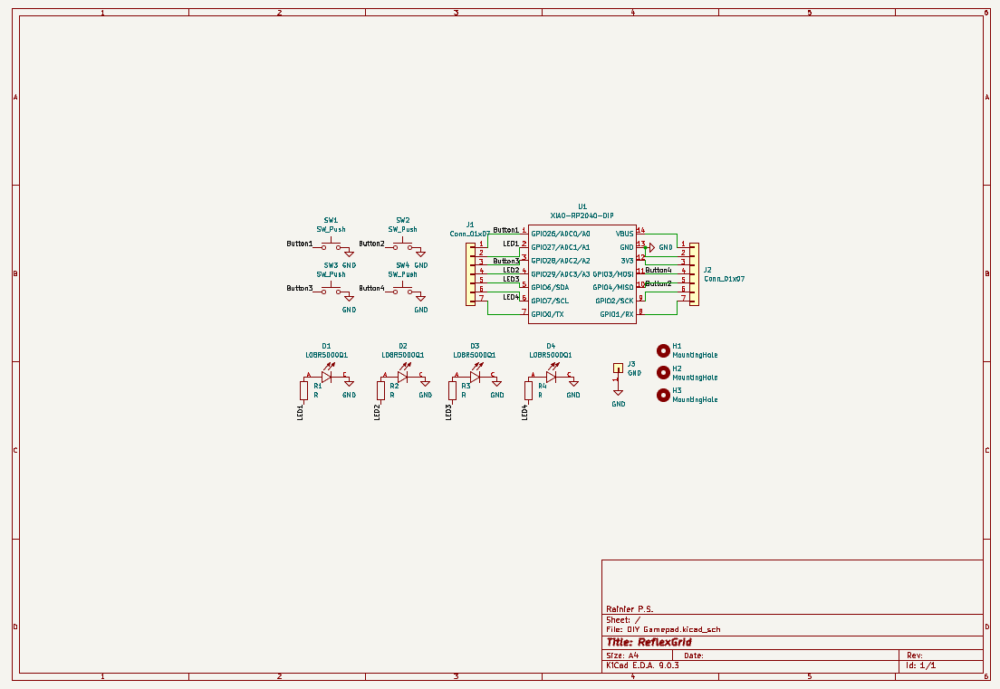
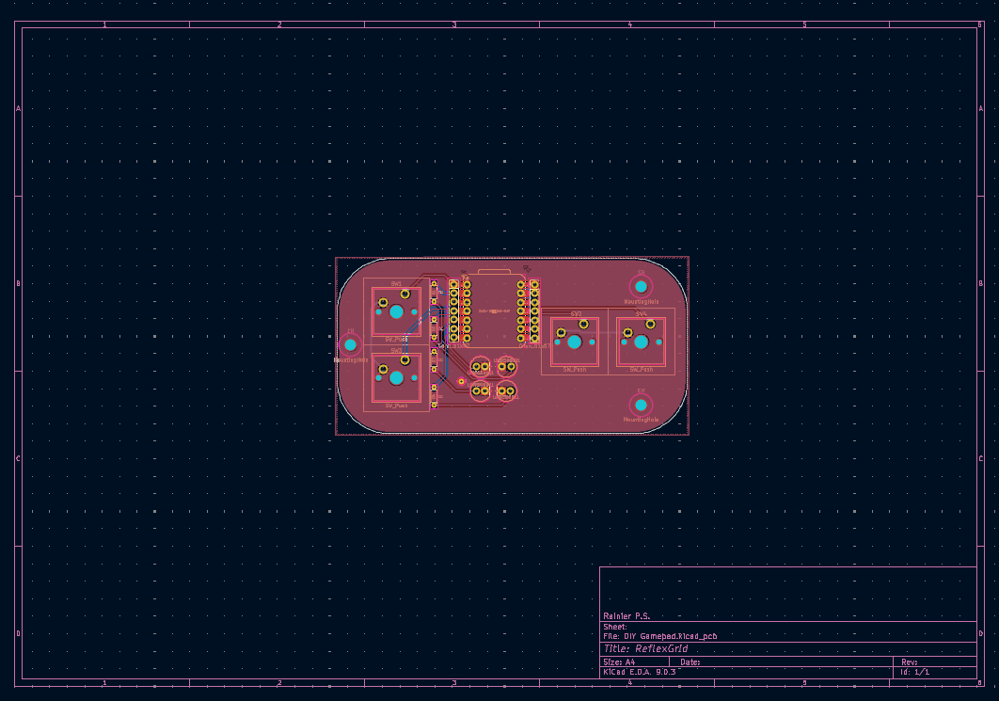
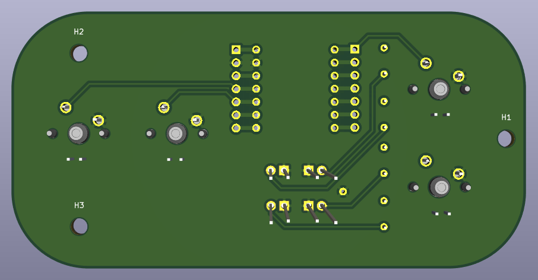

# ReflexGrid

> ReflexGrid is a minimalist reflex and movement game played on a 2×2 LED grid with 4 directional buttons. Test your reaction speed and stay alive. Small board. Big tension.



## What is ReflexGrid?

ReflexGrid is an ultra-compact, open-source game board powered by a Seeed Xiao RP2040. It features only 4 mechanical switches and 4 LEDs in a 2×2 layout. ReflexGrid runs a fast-paced **LED dodging game** where players must react quickly to shifting danger zones or face a total wipeout.

More mini-games and expansions are planned in future updates.

## Images

### Schematic  


### PCB Layout  


### ReflexGrid Board - Front  


### ReflexGrid Board - Back  


## Features

- Reflex-based dodging game with increasing difficulty
- Player-controlled movement using 4-direction buttons
- 2×2 LED grid system with live danger indicators
- Clean, readable Arduino code
- Built-in game reset and failure animation
- Fully self-contained, no display or computer needed

## How to Play

- You control a single LED (the "player") using ↑ ↓ ← → buttons.
- A **danger tile** (flashing LED) appears randomly.
- You must **move away from the danger tile** before the timer runs out.
- Survive, and the game speeds up for the next round.
- Stay on the danger tile too long? All LEDs flash → Game Over.

### LED State Reference

| State               | LED Behavior            |
|--------------------|-------------------------|
| Player position     | Solid ON                |
| Danger tile         | Blinking (~5 Hz)        |
| Player on danger    | Lose after ~2 seconds   |
| Game over           | All 4 LEDs blink rapidly|
| New round           | LED moves, game speeds up |

### Button–LED Layout (Top View)

```

[UP]
  ↑
                     [LEFT] ←       → [RIGHT]
  ↓
[DOWN]

```

### LED Grid Layout (Top View)

| Grid Position | LED | GPIO | Location       |
|---------------|-----|------|----------------|
| [0,0]         | 1   | 29   | Upper Left     |
| [1,0]         | 2   | 27   | Upper Right    |
| [0,1]         | 3   | 7    | Lower Left     |
| [1,1]         | 4   | 6    | Lower Right    |

## Future Plans

- Additional game modes (memory, pattern match, chase)
- USB HID gamepad mode with feedback

## Getting Started

### 1. Flash the Code

Upload the `ReflexGrid.ino` sketch to your board using the Arduino IDE with RP2040 support installed.

### 2. Wiring

| Function    | GPIO Pin | Notes             |
|-------------|----------|-------------------|
| Button UP   | GPIO26   | Internal pull-up  |
| Button DOWN | GPIO28   | Internal pull-up  |
| Button LEFT | GPIO4    | Internal pull-up  |
| Button RIGHT| GPIO3    | Internal pull-up  |
| LED UL      | GPIO29   | Upper Left        |
| LED UR      | GPIO27   | Upper Right       |
| LED LL      | GPIO7    | Lower Left        |
| LED LR      | GPIO6    | Lower Right       |

## Advanced Notes

- **GND Test Pad**  
  A dedicated exposed GND pad is included on the PCB for easy multimeter probing and diagnostics. Useful during debugging or for adding temporary modules or sensors.

- **Dual Pin Headers for Xiao**  
  The Xiao RP2040 footprint includes **double/duplicate pin holes**, one for standard mounting, and another inline set for breakout or jumper wiring. This allows GridCore to be used not only as a game system, but also as a **hackable Xiao devboard** for rapid prototyping.

> **Note**  
> This board passes both ERC and DRC checks and meets all Pathfinder hardware submission standards.

---
